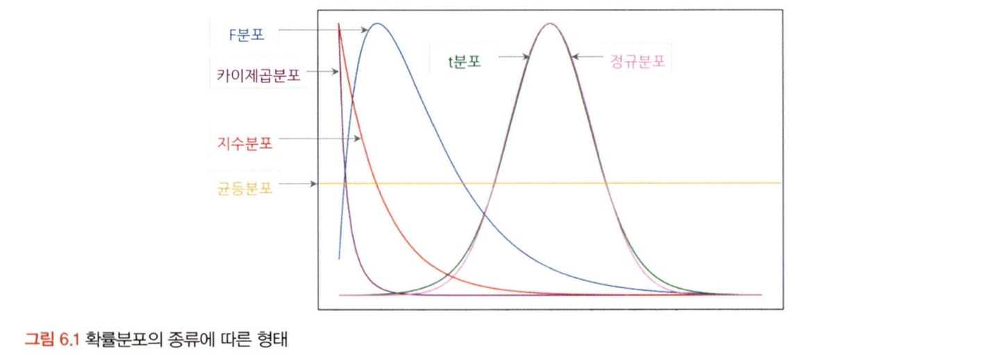
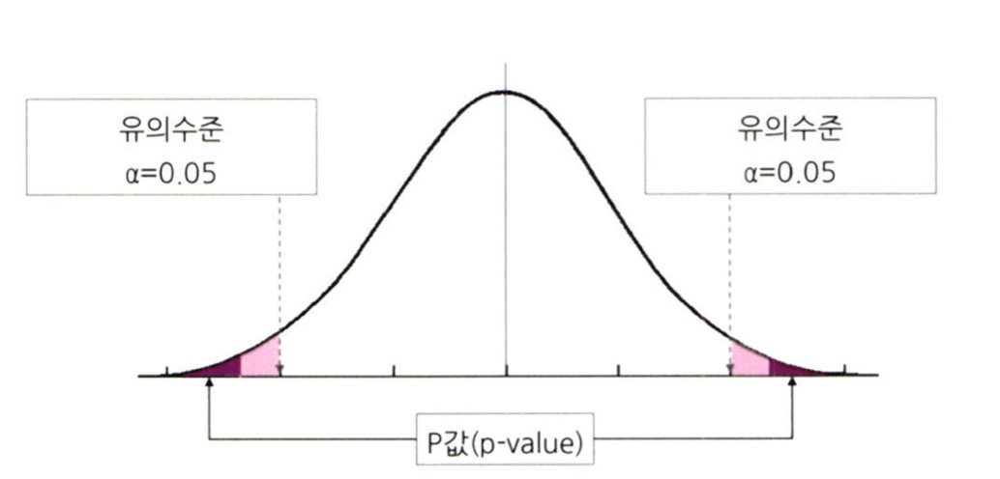

# 통계학 2주차 정규과제

📌통계학 정규과제는 매주 정해진 분량의 『*데이터 분석가가 반드시 알아야 할 모든 것*』 을 읽고 학습하는 것입니다. 이번 주는 아래의 **Statistics_2nd_TIL**에 나열된 분량을 읽고 `학습 목표`에 맞게 공부하시면 됩니다.

아래의 문제를 풀어보며 학습 내용을 점검하세요. 문제를 해결하는 과정에서 개념을 스스로 정리하고, 필요한 경우 추가자료와 교재를 다시 참고하여 보완하는 것이 좋습니다.

2주차는 `1부. 데이터 기초체력 기르기`를 읽고 새롭게 배운 내용을 정리해주시면 됩니다.


## Statistics_2nd_TIL

### 1부. 데이터 기초체력 기르기
### 06. 확률분포
### 07. 가설검정

## Study Schedule

|주차 | 공부 범위     | 완료 여부 |
|----|----------------|----------|
|1주차| 1부 p.2~56     | ✅      |
|2주차| 1부 p.57~79    | ✅      | 
|3주차| 2부 p.82~120   | 🍽️      | 
|4주차| 2부 p.121~202  | 🍽️      | 
|5주차| 2부 p.203~254  | 🍽️      | 
|6주차| 3부 p.300~356  | 🍽️      | 
|7주차| 3부 p.357~615  | 🍽️      |

<!-- 여기까진 그대로 둬 주세요-->

# 06. 확률분포

```
✅ 학습 목표 :
* 이산확률분포의 종류와 특징을 설명할 수 있다.
* 연속확률분포의 종류와 특징을 설명할 수 있다. 
* 중심극한정리(CLT)의 개념을 이해하고 설명 할 수 있다.
```
<br>
<br>



## 6.2. 이산확률분포

> **🧚 이산확률분포에 대해 학습한 내용을 정리해주세요.**

**1. 균등분포(Uniform dstn)**
- X가 동일한 확률을 가짐

**2. 이항분포(Binomial dstn)**
- 성공/실패처럼 1/0의 값만 갖는 분포
- 각 시행이 서로 독립립

**3. 초기하분포(hypergeometric dstn)**
- 비복원추출, 각 시행이 독립적이지 않음

**4. 포아송분포(poisson dstn)**
- 일정한 관측 공간에서 특정 사건이 발생하는 횟수
- 모든 사건은 독립적
- 발생 비율은 항상 동일하고 한 번에 둘 이상 사건이 발생하지 않음


## 6.3. 연속확률분포

> **🧚 연속확률분포에 대해 학습한 내용을 정리해주세요.**

연속확률분포: 특정 구간에 발생할 수 있는 확률

**1. 정규분포(normal dstn)**
- 평균을 중심으로 좌우대칭

**1-2. 표준정규분포(standard normal dstn)**
- N(0, 1)로 표준화된 정규분포

**2. 지수분포(exponential dstn)**
- 특정 시간이 발생한 시점으로부터 다음 사건이 발생할 때까지 시간이 확률변수인 분포
<br>
cf) 포아송분포 - 사건 발생 횟수 vs 지수분포 - 사건 사이 대기 시간
- 람다: 사건 발생 횟수 -> 1/람다(=베타): 다음 사건 발생까지 평균 소요 시간


## 6.4. 중심극한정리

> **🧚 중심극한정리에 대해 학습한 내용을 정리해주세요.**

**CLT**: n이 충분히 커지면(n >= 30) 평균의 분포는 정규분포에 근사
<br>
*표본의 평균=모집단의 평균을 의미하는 것이 아님*


# 07. 가설검정

```
✅ 학습 목표 :
* 귀무가설과 대립가설의 개념을 정의하고, 주어진 연구 질문에 적절한 가설을 설정할 수 있다.
* 가설검정의 유의수준과 p값의 개념을 설명하고, p값을 해석하여 귀무가설을 기각할지 여부를 판단할 수 있다.
* 1종 오류와 2종 오류의 차이를 설명하고, 실제 사례에서 어떤 오류를 더 중요하게 고려해야 하는지 판별할 수 있다.
```
**데이터 분석의 네 가지 목적성**
- 기술적 분석: 어떤 일이 발생했는지지 파악하기 위한 분석, 데이터 분포, 추세 등 분석
- 진단적 분석: 발생한 사건의 원인 분석, 데이터 간의 관계 분석
- 예측 분석: 미래에 어떤 일이 어느 정도의 확률로 일어날지 예측, 기계학습 모델 등 사용
- 처방적 분석: 예측되는 미래의 결과를 위해 어떻게 하면 좋을지 처방 , 제한된 자원으로 최적의 성과를 내는 방향향

**귀무가설과 대립가설**
- 귀무가설: 증명하고자 하는 가설과 반대, 효과와 차이 X
- 대립가설: 귀무가설이 기각되었을 때 대안적으로 채택되난 가설

**가설검정의 절차**
- 가설 설정 -> 유의수준 설정 -> 실험 수행 -> 검정 통계량 산출 -> 대립가설 기각/채택

**가설검정의 유의수준과 p값**
- 유의수준 <-> 신뢰수준 ex) 유의수준 0.05이면 신뢰수준은 0.95
- p-value < 0.05: 귀무가설 기각


**1종 오류 & 2종 오류**
- 1종 오류: 귀무가설이 참인데 귀무가설 기각 = 알파
- 2종 오류: 귀무가설이 거짓인데 귀무가설 채택 = 베타
- 알파와 베타는 상충관계
- 일반적으로 알파=0.05, 1-베타(검정력)=0.2를 기준으로 사용용


<br>
<br>

# 확인 문제

## 문제 1.

> **🧚Q. 다음 중 귀무가설(H₀)을 기각해야 하는 경우는 언제인가요? 정답을 고르고, 그 이유를 간단히 설명해주세요.**

> **1️⃣ 유의수준(α)이 0.05이고, p값이 0.03일 때   
2️⃣ 유의수준(α)이 0.01이고, p값이 0.02일 때**

```
1. p-value=0.03 < 알파=0.05 -> 귀무가설 기각
2. p-value=0.02 > 알파=0.01 -> 귀무가설 채택
따라서, 1번일 때 귀무가설을 기각해야 한다. 
```

### 🎉 수고하셨습니다.