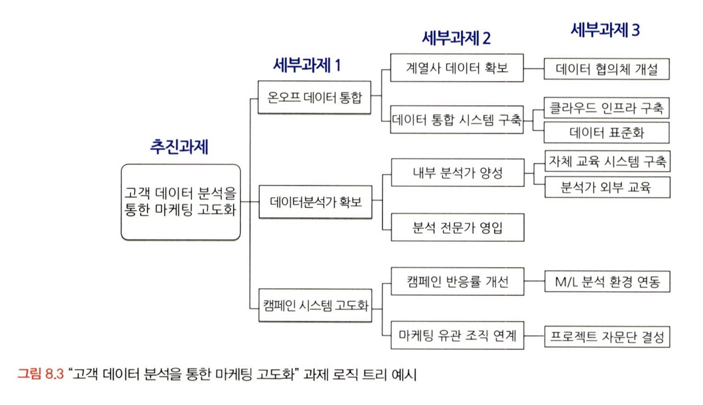
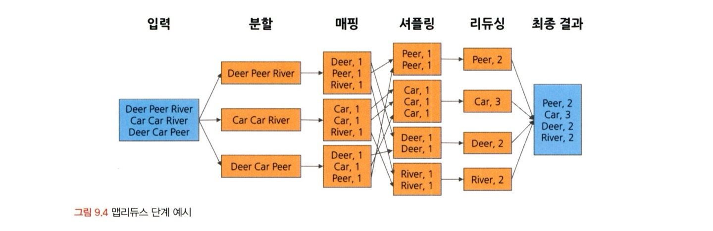
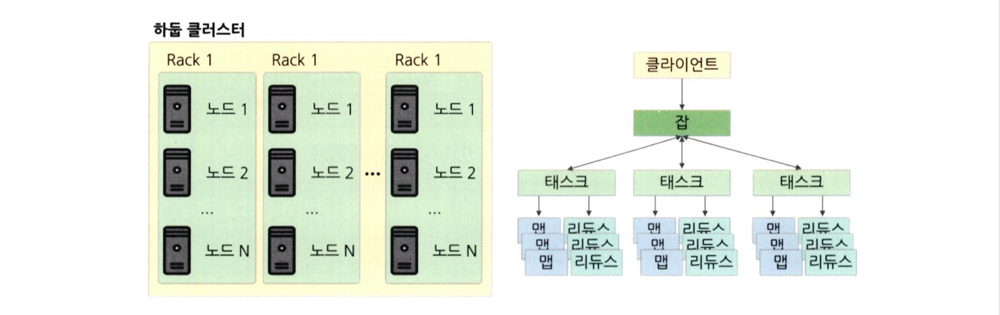

# 통계학 3주차 정규과제

📌통계학 정규과제는 매주 정해진 분량의 『*데이터 분석가가 반드시 알아야 할 모든 것*』 을 읽고 학습하는 것입니다. 이번 주는 아래의 **Statistics_3rd_TIL**에 나열된 분량을 읽고 `학습 목표`에 맞게 공부하시면 됩니다.

아래의 문제를 풀어보며 학습 내용을 점검하세요. 문제를 해결하는 과정에서 개념을 스스로 정리하고, 필요한 경우 추가자료와 교재를 다시 참고하여 보완하는 것이 좋습니다.

2주차는 `2부-데이터 분석 준비하기`를 읽고 새롭게 배운 내용을 정리해주시면 됩니다.


## Statistics_3rd_TIL

### 2부. 데이터 분석 준비하기
### 08. 분석 프로젝트 준비 및 기획
### 09. 분석 환경 세팅하기


## Study Schedule

|주차 | 공부 범위     | 완료 여부 |
|----|----------------|----------|
|1주차| 1부 p.2~56     | ✅      |
|2주차| 1부 p.57~79    | ✅      | 
|3주차| 2부 p.82~120   | ✅      | 
|4주차| 2부 p.121~202  | 🍽️      | 
|5주차| 2부 p.203~254  | 🍽️      | 
|6주차| 3부 p.300~356  | 🍽️      | 
|7주차| 3부 p.357~615  | 🍽️      |  

<!-- 여기까진 그대로 둬 주세요-->

# 08. 분석 프로젝트 준비 및 기획

```
✅ 학습 목표 :
* 데이터 분석 프로세스를 설명할 수 있다.
* 비즈니스 문제를 정의할 때 주의할 점을 설명할 수 있다.
* 외부 데이터를 수집하는 방법에 대해 인식한다.
```
**데이터 분석의 3단계**
설계 -> 분석 및 모델링 -> 구축 및 활용
<br>
1. 설계 단계
- 과제 정의 및 범위 설정
- 인력 구성 및 PM 확보
- 실무자와 데이터 분석가 간 협의 체계 수립
<br>
2. 분석 및 모델링 단계
- 데이터 분석을 위한 서버 환경 구축
- 데이터 준비, 가공, 분석 및 모델 도출
- 모델 검증 및 실무, 경영진 협의
- KDD 분석 방법론, CRISP-DM 방법론, SAS의 SEMMA 방법론
<br>
3. 구축 및 활용 단계
- 모델 적용 및 시스템 구축
- 성과 평가 및 추가, 보완 프로젝트 검토

<br>

**CRISP-DM 방법론**

비지니스 이해 -> 데이터 이해 -> 데이터 준비 -> 모델링 -> 평가 -> 배포
<br>
1. 비지니스 이해
- 현재 상황 평가
- 데이터 마이닝 목표 결정
- 프로젝트 계획 수립

2. 데이터 이해
- 데이터 설명
- 데이터 탐색
- 데이터 품질 확인

3. 데이터 준비
- 데이터 선택
- 데이터 정체
- 필수 데이터 구성
- 데이터 통합

4. 모델링
- 모델링 기법 선정
- 테스트 디자인 생성
- 모델 생성
- 모델 평가

5. 평가
- 결과 평가
- 프로세스 검토
- 다음 단계 결정

6. 배포
- 배포 계획
- 모니터링 및 유지 관리 계획
- 최종 보고서 작성
- 프로젝트 검토 
<br>

**SAS SEMMA 방법론**

sampling -> exploration -> madification -> modeling ->assessment
<br>
1. sampling
- 전체 데이터에서 분석용 데이터 추출
- 의미 있는 정보를 추출하기 위한 데이터 분할 및 병합
- 표본추출을 통해 대표성을 가진 분석용 데이터 생성
- 분석 모델 생성을 위한 학습, 검증, 테스트 데이터셋 분할
2. exploration
- 통계치 확인, 그래프 생성 등을 통해 데이터 탐색
- 상관분석, 클러스터링 등을 통해 변수 간의 관계 파악
- 분석 모델에 적합한 변수 선정
- 데이터 현황을 파악하여 비즈즈니스 아이디어 도출 및 분석 방향 수정
3. modification
- 결측값 처리 및 최종 분석 변수 선정
- 로그변환, 구간화(binning) 등 데이터 가공
- 주성분분석(PCA) 등을 통해 새로운 변수 생성
4. modeling
- 다양한 데이터마이닝 기법 적용에 대한 적합성 검토
- 비즈니스 목적에 맞는 분석 모델을 선정하여 분석 알고리즘 적용
- 지도학습, 비지도학습, 강화학습 등 데이터 형태에 따라 알맞은 모델 선정
- 분석 환경 인프라 성능과 모델 정확도를 고려한 모델 세부 옵션 설정
5. assessment
- 구축한 모델들의 예측력 등 성능을 비교, 분석, 평가
- 비즈니스 상황에 맞는 적정 임계치 설정
- 분석 모델 결과를 비즈니스 인사이트에 적용
- 상황에 따라 추가적인 데이터 분석 수행
<br>

*초반부에는 문제와 해결 방향을 명확히 정의하고 데이터 탐색 / 중반부에는 데이터를 목적에 맞도록 수집 및 가공 / 후반부: 데이터 분석 결과를 검토 및 검증하고 실제 환경에 적용*


**비즈니스 문제 정의와 분석 목적 도출**
MECE(Mutually Exclusive Collectively Exhaustive)
- 세부 정의들이 서로 겹치지 않고 합쳤을 때 완전히 전체를 이루는 것
- 로직 트리를 이용하여 세부 항목 정리 


<br>

- 비즈니스 문제는 명확하고 직관적인 한 문정으로 정리할 수 있어야 함
- 현상에 대한 설명으로 그치면 안되고, 본질적인 문제점 함께 전달

**분석 목적의 전환**
- 분석 프로젝트의 방향이 언제든 바뀔 수 있는 것 염두

**외부 데이터 수집과 크롤링**
- 데이터 수집 -> 데이터 통합 -> 지역 분석 -> 시각화 등의 절차

외부데이터를 수집하는 방법
- 데이터 판매 기업으로부터 구매, MOU 등을 통해 데이터 공유
- 공공 오픈 데이터 사이트
- 웹의 데이터 크롤링 

크롤링 시 주의 필요
- 일반적으로, robots.txt 파일로 접속 주체에 따른 크롤링 허용 범위 안내 


# 09. 분석 환경 세팅하기

```
✅ 학습 목표 :
* 데이터 분석의 전체적인 프로세스를 설명할 수 있다.
* 테이블 조인의 개념과 종류를 이해하고, 각 조인 방식의 차이를 구분하여 설명할 수 있다.
* ERD의 개념과 역할을 이해하고, 기본 구성 요소와 관계 유형을 설명할 수 있다.
```

**데이터 처리 프로세스**

OLTP -> DW -> DM -> OLAP
- OLTP: 실시간으로 데이터를 트랜잭션 단위로 수집, 분류, 저장하는 시스템
- DW(Data Warehouse): 데이터를 저장해 놓은 통합 데이터베이스
- DM(Data Mart): 사용자의 목적에 맞도록 가공된 일부의 데이터가 저장되는 곳
  - ETL: 추출, 변환, 불러내기의 줄임말 / 저장된 데이터를 사용자가 요구하는 포맷으로 변형하여 이동시키는 작업 과정

**분산데이터 처리**

1. HDFS(Hadoop Distributed File System)
- 슬레이브 노드: 데이터 저장, 계산
- 마스터 노드: 대량의 데이터를 저장하고 맵리듀스 방식을 통해 데이터를 병렬 처리
- 클라이언트 머신: 맵리듀스 작업을 통해 산출된 결과를 사용자에게 보여줌

2. 맵리듀스
- HDFS에 저장된 데이터를 효과적으로 처리하ㅡㄴ 방법
- 맵: 관련된 데이터끼리 묶어서 임시의 집합 생성
- 리듀스: 필터링과 정렬을 거쳐 데이터 추출
- 분할, 매핑, 셔플링, 리듀싱 단계를 거쳐 단어의 수를 셈


3. 하둡
- 하둡 1.0: HDFS, 맵리듀스, JobTracker(리소스 관리 시스템)
- 하둡 2.0: + YARN(리소스 관리자)

**분산 시스템 구조**


- 물리적 구성: 노드 < 랙 < 클러스터
- 시스템: 클라이언트 -> 잡 -> 태스크 -> 맵, 리듀스

**테이블 조인**
- 레스트 조인, 라이트 조인
- 이너 조인: 교집합인 행만 가져오는 조인 방법
- 풀 조인: 합집합인 행을 가져오는 조인 방법
- 크로스 조인: 값이 없더라도 모든 행이 생기도록 할 때 사용

**데이터 단어사전**
- 각 컬럼과 테이블의 이름을 정할 때 체계를 약속한 일종의 사전
1. 테이블 정의서
- 메타데이터 관리 시스템을 간소화한 버전
2. ERD
- 각 테이블의 구성 정보와 테이블 간의 관계를 도식으로 표현
- 물리 ERD: DB를 효율적이고 결점 없이 구현하는 것이 목표
- 논리 ERD: 테이블 간 매핑에 오류가 없고 데이터의 정규화가 이루어짐 
- 기본 키(데이터를 유일하게 구분), 외래 키(다른 테이블의 참조가 되는 키)
- 테이블 간 1:1, 1:N or N:N 등 매칭되므로 관계를 정확히 파악해야 함
<br>
<br>

# 확인 문제

## 문제 1.

> **🧚 아래의 테이블을 조인한 결과를 출력하였습니다. 어떤 조인 방식을 사용했는지 맞춰보세요.**

> 사용한 테이블은 다음과 같습니다.

|
---|---|

> 보기: INNER, LEFT, RIGHT 조인

<!-- 테이블 조인의 종류를 이해하였는지 확인하기 위한 문제입니다. 각 테이블이 어떤 조인 방식을 이용하였을지 고민해보고 각 테이블 아래에 답을 작성해주세요.-->

### 1-1. 

```
left 조인
```

### 1-2. 

```
inner 조인
```

### 1-3. 

```
right 조인 
```

### 🎉 수고하셨습니다.