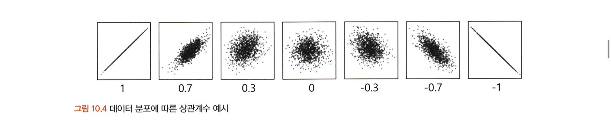
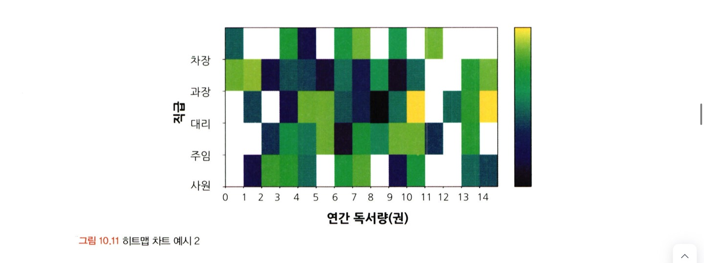
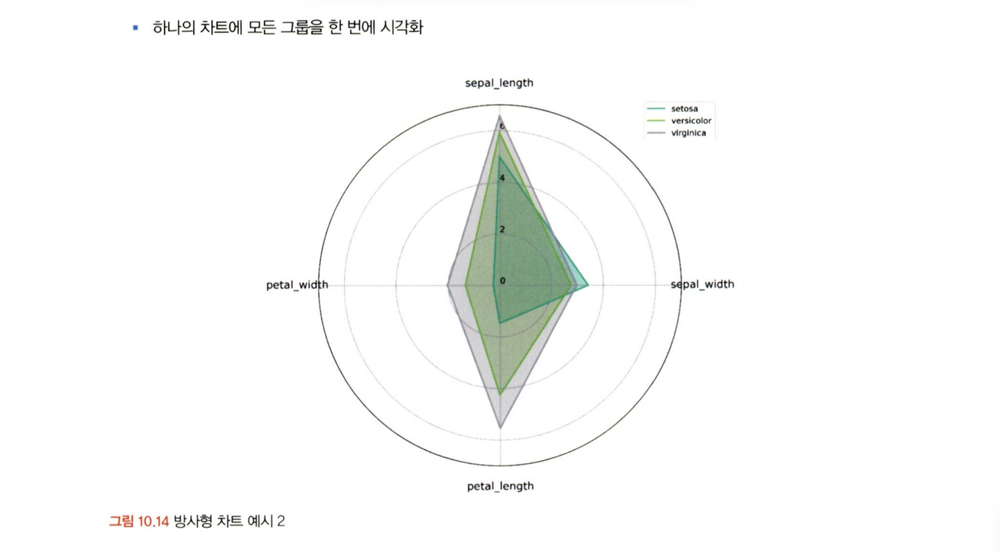
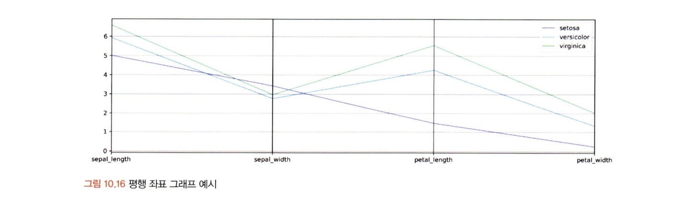
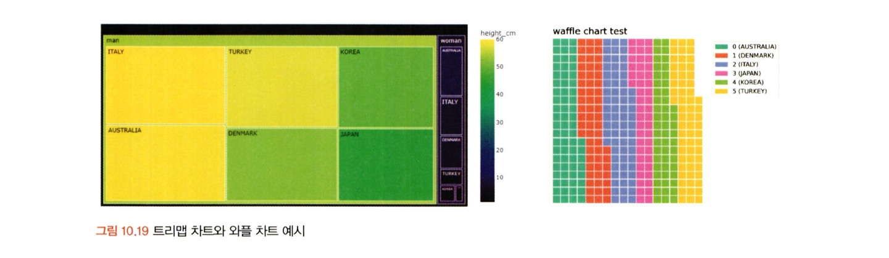
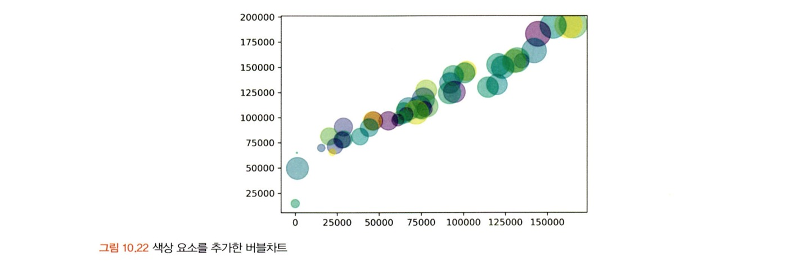
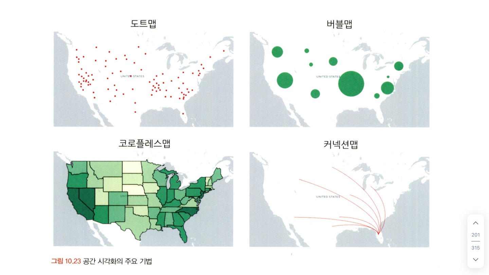

# 통계학 4주차 정규과제

📌통계학 정규과제는 매주 정해진 분량의 『*데이터 분석가가 반드시 알아야 할 모든 것*』 을 읽고 학습하는 것입니다. 이번 주는 아래의 **Statistics_4th_TIL**에 나열된 분량을 읽고 `학습 목표`에 맞게 공부하시면 됩니다.

아래의 문제를 풀어보며 학습 내용을 점검하세요. 문제를 해결하는 과정에서 개념을 스스로 정리하고, 필요한 경우 추가자료와 교재를 다시 참고하여 보완하는 것이 좋습니다.

4주차는 `2부. 데이터 분석 준비하기`를 읽고 새롭게 배운 내용을 정리해주시면 됩니다.


## Statistics_4th_TIL

### 2부. 데이터 분석 준비하기
### 10. 데이터 탐색과 시각화


## Study Schedule

|주차 | 공부 범위     | 완료 여부 |
|----|----------------|----------|
|1주차| 1부 p.2~56     | ✅      |
|2주차| 1부 p.57~79    | ✅      | 
|3주차| 2부 p.82~120   | ✅      | 
|4주차| 2부 p.121~202  | ✅      | 
|5주차| 2부 p.203~254  | 🍽️      | 
|6주차| 3부 p.300~356  | 🍽️      | 
|7주차| 3부 p.357~615  | 🍽️      | 

<!-- 여기까진 그대로 둬 주세요-->

# 10. 데이터 탐색과 시각화

```
✅ 학습 목표 :
* EDA의 목적을 설명할 수 있다.
* 주어진 데이터셋에서 이상치, 누락값, 분포 등을 식별하고 EDA 결과를 바탕으로 데이터셋의 특징을 해석할 수 있다.
* 공분산과 상관계수를 활용하여 두 변수 간의 관계를 해석할 수 있다.
* 적절한 시각화 기법을 선택하여 데이터의 특성을 효과적으로 전달할 수 있다.
```

**EDA와 시각화**
- EDA 단계에서 더 효율적인 데이터 파악을 위해 시각화 사용 有, 데이터 시각화의 궁극적인 목적은 분석 결과를 커뮤니케이션하는 것


## 10.1 탐색적 데이터 분석

- EDA: 가공하지 않은 데이터를 있는 그대로 탐색하고 분석, 극단적이거나 자의적 해석 지양

**EDA를 하는 주요 목적**
- 데이터의 형태와 척도가 분석에 알맞게 되어있는 지 확인
- 데이터 특성 파악(평균, 분산, 분포, 패턴)
- 데이터의 결측값이나 이상치 파악 및 보완
- 변수 간의 관계성 파악
- 분석 목적과 방향성 점검 및 보정

**EDA 실습**
- head(): 데이터가 제대로 로드됐는지 확인
- info(): 데이터의 전반적인 정보(행과 열 크기, 자료형 등) -> 데이터 타입이 올바르게 되어있는지 확인 
- describe(): 평균, 표준편차, 최대최솟값 등을 확인
- skew(), kurtosis(): 왜도, 첨도 확인 -> 정규성이 필요한 경우 로그변환, 정규화, 표준화 등 사용


## 10.2 공분산과 상관성 분석

각 변수들의 특성 파악 -> 타겟변수와 설명변수의 관계와 설명변수 간의 관계 파악

**공분산**
- 공분산: 서로 공유하는 분산, 두 분산의 관계

**상관계수**
- 공분산은 각 변수 간 다른 척도기준이 그대로 반영되어 상관성의 정도를 나타내지 못함
- 상관계수: -1 <= R <= 1
- *산점도의 기울기와 상관계수는 관련 X*
- 결정계수 R^2: 총 변동 중에 회귀선에 의해 설명되는 변동이 차지하는 비율


**변수 척도에 따른 상관분석 방법**
- Pearson correlation coefficient: 간격/비율 - 간격/비율
- Spearman's rank correlation coefficient: 서열 - 서열
- Point-biserial correlation coefficient: 간격/비율 - 명목(2분 변수)
- Phi coefficient: 명목(2분 변수) - 명목(2분 변수)
- Cramer's coefficient: 명목 - 명목(2x2 이상)


**공분산과 상관성 분석 실습**

산점도 행렬 시각화
```python
sns.set(font_scale=1.1) # 폰트 크기 설정
sns.set_style('ticks') # 축 눈금 설정 
sns.pairplot(df,
             diag_kind='kde') # 상관계수가 1이면 분포로 표시)
plt.show()
```

공분산 확인
```python
df.cov()
```

피어슨 상관계수 확인
```python
df.corr(method='pearson')
```

상관계수 시각화
```python
# 히트맵 시각화
sns.heatmap(df.corr(), cmap='viridis')

# clustermap 시각화
sns.clustermap(df.corr(),
               annot = True,
               cmap = 'RdYlBu_r',
               vmin = -1, vmax = 1)
```

## 10.3 시간 시각화
- 시간의 흐름에 따른 데이터의 변화 표현: 시계열 형태
- 연속형: 시간 간격의 밀도가 높을 때 선그래프 사용 -> 추세선으로 전체적인 경향이나 패턴 파악
- 분절형: 막대그래프, 점그래프 이용


**시간 시각화 실습**
```python
# 선그래프 시각화

# date 칼럼 날짜 형식 변환
df['Date2'] = pd.to_datetime(df['Order Date'], infer_datetime_format=True)

# 날짜 오름차순 정렬
df = df.sort_values(by='Date2')

# 연도 칼럼 생성
df['Year'] = df['Date2'].dt.year

## 선그래프 용 데이터셋 생성
# 2018년 데이터만 필터링
df_line = df[df.Year == 2018]

# 2018년 일별 매출액 가공
df_line = df_line.groupby('Date2')['Sales'].sum().reset_index()

df_line.head()

# 30일 이동평균 생성(추세선)
df_line['Month'] = df_line['Sales'].rolling(window=30).mean()

# 선그래프 시각화
ax = df_line.plot(x='Date2', y='Sales', linewidth = "0.5")
df_line.plot(x='Date2', y='Month', color='#FF7F50', linewidth = "1", ax=ax)
```


## 10.4 비교 시각화
1. 히트맵 차트
- 그룹과 비교 요소가 많을 때 효과적으로 시각화 가능


2. 방사형 차트 
- for문을 이용하기 때문에 코드가 복잡한 편


3. 평행 좌표 그래프
- 효과적으로 표현하기 위해 정규화 실시 


## 10.5 분포 시각화
양적 척도/질적 척도를 구분하여 시각화
- 양적 척도: 막대그래프, 선그래프, 히스토그램
- 질적 척도: 파이차트, 도넛차트, 트리맵 차트, 와플차트 


## 10.6 관계 시각화
변수 간의 관계 시각화 ex. 공분산, 상관분석

1. 산점도
- 극단치를 제거하고 그리는 것이 좋음, 시각화의 효율이 떨어지기 때문
- 변수 간 관계만 표현 가능능

2. 버블차트
- 버블의 킉를 통해 관측치 크기도 파악 가능


# 10.7 공간 시각화
- 데이터가 지리적 위치와 관련되어 있으면 실제 지도 위에 데이터를 표현하는 것이 효과적
- 거시적에서 미시적으로 진행되는 분석 방향과 같이 스토리라인을 잡고 시각화를 적용하는 것이 좋음

1. 도트맵
- 지리적 위치에 동일한 크기의 점을 찍어 해당 지역의 데이터 분포나 패턴 표현
- 시각적으로 데이터 개요를 파악하는 데 유리하지만, 정확한 값 전달 X

2. 버블맵
- 버블차트를 지도에 옮겨 둔 것
- 데이터의 값이 원의 크기로 표현

3. 코로플레스맵
- 데이터 값의 크기에 따라 색상의 음영을 달리하여 해당 지역에 대한 값을 시각화
- 작은 지역들에 비해 큰 지역이 강조되는 인상을 줄 수 있어 유의

4. 커넥션맵/링크맵
- 지도에 찍힌 점들을 곡선 또는 직선으로 연결하여 지리적 관계 표현
- 지역 간의 무역관계, 항공 경로, 통신 정보 흐름 등 표현할 때 사용


## 10.8 박스 플롯
- 양적 척도 데이터의 분포 및 편향성, 평균과 중앙값 등 다양한 수치를 보기 쉽게 정리
- 최솟값(Q1 - 1.5xIQR), Q1, Q2, Q3, 최댓값(Q3 - 1.5xIQR)

<br>
<br>

# 확인 문제

## 문제 1.
> **🧚 공분산과 상관계수의 차이점에 대해 간단히 설명하세요.**

```
공분산은 변수 간 다른 척도가 적용되어 상관성을 나타내지 못하지만, 상관계수는 정규화를 하기 때문에 -1에서 1 사이의 값을 가진다. 
```

## 문제 2.
> **🧚 다음 데이터 분석 목표에 적합한 시각화 방법을 보기에서 모두 골라 연결해주세요.**

> 보기: 산점도, 선그래프, 막대그래프, 히스토그램, 박스플롯

(a) 변수의 분포 확인 
(b) 두 변수 간의 관계 확인   
(c) 집단별 평균 비교   
(d) 시계열 데이터 분석

<!--중복 가능-->

```
(a) 히스토그램, 박스플롯
(b) 산점도
(c) 막대그래프, 박스플롯
(d) 선그래프(연속형), 막대그래프(분절형)
```


### 🎉 수고하셨습니다.