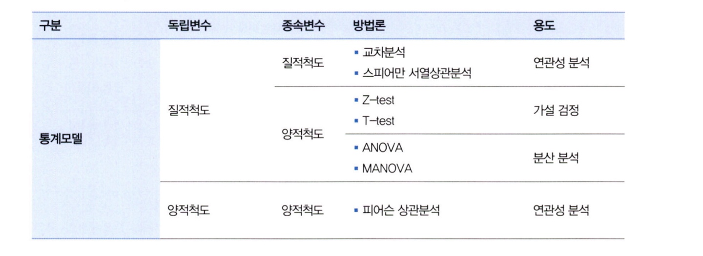
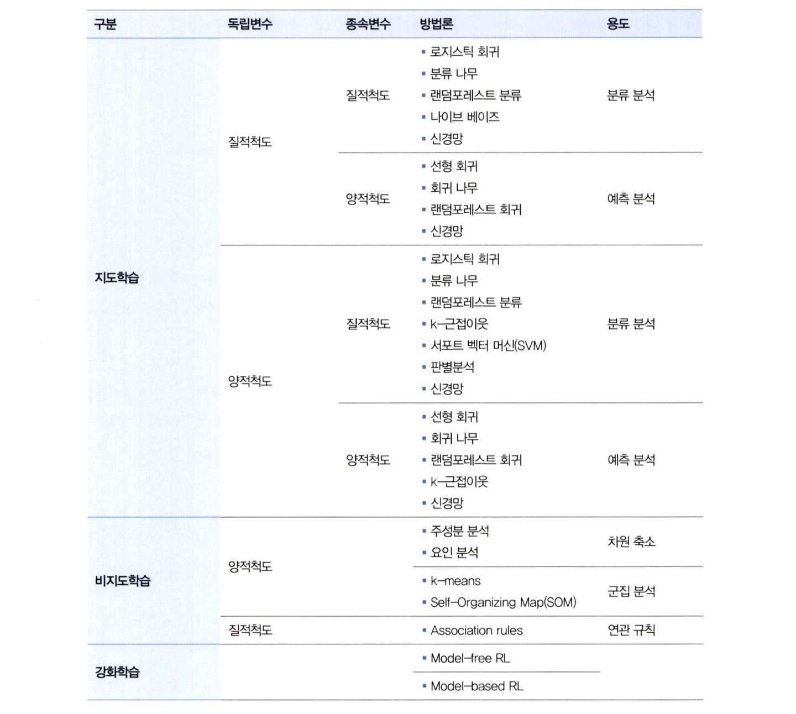

# 통계학 6주차 정규과제

📌통계학 정규과제는 매주 정해진 분량의 『*데이터 분석가가 반드시 알아야 할 모든 것*』 을 읽고 학습하는 것입니다. 이번 주는 아래의 **Statistics_6th_TIL**에 나열된 분량을 읽고 `학습 목표`에 맞게 공부하시면 됩니다.

아래의 문제를 풀어보며 학습 내용을 점검하세요. 문제를 해결하는 과정에서 개념을 스스로 정리하고, 필요한 경우 추가자료와 교재를 다시 참고하여 보완하는 것이 좋습니다.

6주차는 `3부. 데이터 분석하기`를 읽고 새롭게 배운 내용을 정리해주시면 됩니다.


## Statistics_6th_TIL

### 3부. 데이터 분석하기
### 12.통계 기반 분석 방법론


## Study Schedule

|주차 | 공부 범위     | 완료 여부 |
|----|----------------|----------|
|1주차| 1부 p.2~56     | ✅      |
|2주차| 1부 p.57~79    | ✅      | 
|3주차| 2부 p.82~120   | ✅      | 
|4주차| 2부 p.121~202  | ✅      | 
|5주차| 2부 p.203~254  | ✅      | 
|6주차| 3부 p.300~356  | ✅      | 
|7주차| 3부 p.357~615  | 🍽️      |

<!-- 여기까진 그대로 둬 주세요-->

# 12.통계 기반 분석 방법론

```
✅ 학습 목표 :
* 주성분 분석(PCA)의 개념을 설명할 수 있다.
* 다중공선성을 진단할 수 있다.
* Z-TEST와 T-TEST의 개념을 비교하고, 적절한 상황에서 검정을 설계하고 수행할 수 있다.
* ANOVA TEST를 활용하여 세 개 이상의 그룹 간 평균 차이를 검정하고, 사후검정을 수행할 수 있다.
* 카이제곱 검정을 통해 범주형 변수 간의 독립성과 연관성을 분석하는 방법을 설명할 수 있다.
```

## 12.1. 분석 모델 개요
**데이터 분석 방법론**
- 통계 모델: 모형과 해석 중요, 오차와 불확정성 강조, 통계학 기반
- 기계 학습: 대용량 데이터를 활용하여 예측의 정확도를 높이는 것을 중요시 함

**데이터 분석 방법론 개요**




## 12.2. 주성분 분석(PCA)
**PCA**
- 여러 개의 독립변수들을 잘 설명해줄 수 있는 주된 성분을 추출하는 기법
- 여러 개이 변수들이 소수의 특정한 소수의 변수들로 축약되도록 가공

**차원을 감소하는 방법**
- 변수 선택을 통해 비교적 불필요하거나 유의성이 낮은 변수를 제거하는 방법
- 변수들의 잠재적인 성분을 추출하여 차원을 줄이는 방법

- 주성분의 설명력: 전체 분산 중에서 해당 주성분이 갖고 있는 분산

**공통요인분석(CFA)**
- 이미 변수들의 속성을 예상하고 있는 상태에서 실제로 구조가 그러한지 확인

-> PCA, CFA 같은 요인분석을 하기 위해서는 독립변수들 간의 상관성이 요인분석에 적합한지 검증 필요
  - 바틀렛 테스트, KMO 검정


## 12.4. 다중공선성 해결과 섀플리 밸류 분석
**다중공선성**
- 독립변수들 간 상관관계가 높은 현상

-> VIF값이 높은 변수들 중에서 종속변수와 상관성이 가장 낮은 변수를 제거


**새플리 벨류**
- 각 독립변수가 종속변수의 설명력에 기여하는 순수한 수치를 계산

## 12.6. Z-test와 T-test
1.  Z-test: 단일 집단의 평균값/비율 차이, 두 집단의 평균값/비율 차이 분석, *n >= 30*
2.  t-test: 단일 집단의 평균값/비율 차이, 두 집단의 평균값/비율 차이 분석, *n<30일 때도 가능*
- Z-test, t-test를 하기 전에 정규성 검정, 등분산성 검정 필요

```PYTHON
# 데이터 정규성 검정
print(shapiro(df['Var1_a']))
print(shapiro(df['Var1_b']))
print(shapiro(df['Var2_a']))
print(shapiro(Df['Var2_b']))

# 데이터 등분산성 검정
stats.bartlett(df['Var1_a'], df['Var1_b'])
stats.bartlett(df['Var2_a'], df['Var2_b'])

# 독립표본 Z-test
print(ztest(df['Var1_a'], x2=df['Var2_a'], value=0, alternative='two-sided'))

# 독립표본 t-test
ttest_ind(df['Var1_a'], df['Var2_a'], equal_var=False)
```

## 12.7. ANOVA
1. ANOVA: 단일 집단의 두 개 이상 평균값/비율 차이, 두 집단 이상의 평균값/비율 차이 분석, *n >= 30*
- F-분포 이용
```python
# stats 패키지로 검정
F-statistic, pVal = stats.f_oneway(df['Var1_a'], df['Var2_a'], ['Var3_a'])
print('일원분산분석 결과: F={0:.1f}, p={1:.5f}'.format(F_statistic, pVal))
```


## 12.8. 카이제곱 검정(교차분석)
1. 카이제곱 검정(교차분석)
- 범주형 변수들 간의 연관성 분석
```python
# 카이제곱 검정용 데이터셋 가공
crosstab = pd.crosstab(df.sex, df.smoke)
crosstab

# 카이제곱 검정
chiresult = chi2_contingency(crosstab, correction = False)
print('Chi square: {}'.format(chiresult[0]))
print('P-value: {}.format(chiresult[1]))
```


<br>
<br>

# 확인 문제

### **문제 1.**
> **🧚 경희는 다트비 교육 연구소의 연구원이다. 경희는 이번에 새롭게 개발한 교육 프로그램이 기존 프로그램보다 학습 성취도 향상에 효과적인지 검증하고자 100명의 학생을 무작위로 두 그룹으로 나누어 한 그룹(A)은 새로운 교육 프로그램을, 다른 그룹(B)은 기존 교육 프로그램을 수강하도록 하였다. 실험을 시작하기 전, 두 그룹(A, B)의 초기 시험 점수 평균을 비교한 결과, 유의미한 차이가 없었다. 8주 후, 학생들의 최종 시험 점수를 수집하여 두 그룹 간 평균 점수를 비교하려고 한다.**   

> **🔍 Q1. 이 실험에서 사용할 적절한 검정 방법은 무엇인가요?**

```
두 집단의 평균을 비교하는 것이기 때문에 t-tset, Z-test가 적절하다.
```

> **🔍 Q2. 이 실험에서 설정해야 할 귀무가설과 대립가설을 각각 작성하세요.**

```
HO: 두 교육 프로그램에 따른 학생들의 최종 시험 점수의 평균은 차이가 없다.
H1: 두 교육 프로그램에 따른 학생들의 최종 시험 점수의 평균은 차이가 있다. 
```

> **🔍 Q3. 검정을 수행하기 위한 절차를 순서대로 서술하세요.**

<!--P.337의 실습 코드 흐름을 확인하여 데이터를 불러온 후부터 어떤 절차로 검정을 수행해야 하는지 고민해보세요.-->

```
데이터 샘플을 확인한 후 describe() 함수를 이용해 기술통계를 확인한다. 정규성 검정과 등분산성 검정을 실시한 후 독립표본 t-test를 실시한다. 이후, p값과 유의수준을 비교하여 귀무가설 기각 여부를 판단한다. 
```

> **🔍 Q4. 이 검정을 수행할 때 가정해야 하는 통계적 조건을 설명하세요.**

```
두 집단의 독립성, 정규성, 등분산성을 가정해야 한다. 
```

> **🔍 Q5. 추가적으로 최신 AI 기반 교육 프로그램(C)도 도입하여 기존 프로그램(B) 및 새로운 프로그램(A)과 비교하여 성취도 차이가 있는지 평가하고자 한다면 어떤 검정 방법을 사용해야 하나요? 단, 실험을 시작하기 전, C 그룹의 초기 점수 평균도 A, B 그룹과 유의미한 차이가 없었다고 가정한다.**

```
세 집단의 평균 비교는 ANOVA가 적절하다. 
```

> **🔍 Q6. 5번에서 답한 검정을 수행한 결과, 유의미한 차이가 나타났다면 추가적으로 어떤 검정을 수행해 볼 수 있을까요?**

```
어떤 집단 간에 차이가 있었는지 사후검정을 실시해야 한다. 대표적으로 Tukey HSD가 있다.
```

---

### **문제 2. 카이제곱 검정**  
> **🧚 다음 중 어떠한 경우에 카이제곱 검정을 사용해야 하나요?   
1️⃣ 제품 A, B, C의 평균 매출 차이를 비교하고자 한다.  
2️⃣ 남성과 여성의 신체 건강 점수 평균 차이를 분석한다.  
3️⃣ 제품 구매 여부(구매/미구매)와 고객의 연령대(10대, 20대, 30대…) 간의 연관성을 분석한다.  
4️⃣ 특정 치료법이 환자의 혈압을 감소시키는 효과가 있는지 확인한다.**  

```
3번의 변수가 둘 다 범주형이므로 3번이다.
```

### 🎉 수고하셨습니다.