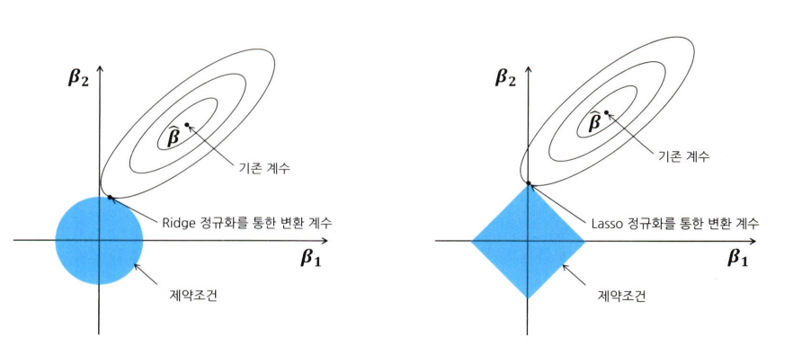

# 통계학 7주차 정규과제

📌통계학 정규과제는 매주 정해진 분량의 『*데이터 분석가가 반드시 알아야 할 모든 것*』 을 읽고 학습하는 것입니다. 이번 주는 아래의 **Statistics_7th_TIL**에 나열된 분량을 읽고 `학습 목표`에 맞게 공부하시면 됩니다.

아래의 문제를 풀어보며 학습 내용을 점검하세요. 문제를 해결하는 과정에서 개념을 스스로 정리하고, 필요한 경우 추가자료와 교재를 다시 참고하여 보완하는 것이 좋습니다.

7주차는 `3부. 데이터 분석하기`를 읽고 새롭게 배운 내용을 정리해주시면 됩니다.


## Statistics_7th_TIL

### 3부. 데이터 분석하기
### 13.머신러닝 분석 방법론
### 14.모델 평가


## Study Schedule

|주차 | 공부 범위     | 완료 여부 |
|----|----------------|----------|
|1주차| 1부 p.2~56     | ✅      |
|2주차| 1부 p.57~79    | ✅      | 
|3주차| 2부 p.82~120   | ✅      | 
|4주차| 2부 p.121~202  | ✅      | 
|5주차| 2부 p.203~254  | ✅      | 
|6주차| 3부 p.300~356  | ✅      | 
|7주차| 3부 p.357~615  | ✅      | 

<!-- 여기까진 그대로 둬 주세요-->

# 13.머신러닝 분석 방법론

```
✅ 학습 목표 :
* 선형 회귀와 다항 회귀를 비교하고, 데이터를 활용하여 적절한 회귀 모델을 구축할 수 있다. 
* 로지스틱 회귀 분석의 개념과 오즈(Odds)의 의미를 설명하고, 분류 문제에 적용할 수 있다.
* k-means 알고리즘의 원리를 설명하고, 적절한 군집 개수를 결정하여 데이터를 군집화할 수 있다.
```

## 13.1. 선형 회귀분석과 Elastic Net(예측모델)
**회귀분석**
- 종속변수 Y의 값에 영향을 주는 독립변수 X들의 조건을 고려하여 구한 평균값


**최적의 회귀선**
- 회귀선과 각 관측치를 뜻하는 점간의 거리 최소화
- 예측치와 관측치들 간의 수직 거리(오차)의 제곱합을 최소로 하는 직선 -> 최소제곱추정법

**조건**
- 잔차의 정규성
- 잔차의 등분산성
- 독립변수들 간의 독립성
- 선형성

**비선형인 경우**
- 변수를 구간화하여 더미변수 생성
- 심하지 않은 경우, 로그함수 이용

**다항회귀**
- 독립변수와 종속변수의 관계가 곡선형 관계일 때 변수에 각 특성의 제곱을 추가하여 회귀선을 곡선형으로 변환
- Ridge: 전체 변수를 모두 유지하면서 각 변수의 계수 크기를 조정
- Lasso: 중요한 몇 개의 변수만 선택하고 나머지 변수들은 계수를 0으로 주어 변수의 영향력을 아예 없앰

## 13.2. 로지스틱 회귀분석 (분류모델)
**로지스틱 회귀분석**
- 기존의 선형회귀랑 비슷하지만 종속변수를 1이 될 확률로 변환하여 0과 1의 여부 예측
**시그모이드**
- 확률을 로짓 변환하여 0에서 1 사이로 치환 
**다항 로지스틱 회귀분석**
- 각 범주마다 이항 로지스틱을 시행하여 확률을 구함

## 13.8. k-means 클러스터링(군집모델)
**k-means 클러스터링**
- 비지도학습
- 중심점과 군집 내 관측치 간의 거리를 비용함수로 하여 이 함수 값이 최소화되도록 중심점과 군집을 반복적으로 재정의

- 지역 최솟값 문제를 방지하기 위해 초기 중심점 선정 방법을 다양하게 하여 최적의 모델을 선정


# 14. 모델 평가

```
✅ 학습 목표 :
* 유의확률(p-value)을 해석할 때 주의할 점을 설명할 수 있다.
* 분석가가 올바른 주관적 판단을 위한 필수 요소를 식별할 수 있다.
```

## 14.3. 회귀성능 평가지표
**결정계수와 수정 결정계수**
- 모델의 설명력을 나타냄
- 독립 변수의 개수가 많아질수록 값이 커지는 문제 보정 -> 수정 결정계수 

**RMSE**
- 편차 제곱의 평균에 루트를 씌움, 실제 수치와 예측 수치의 차이 확인

**MAE**
- 실젯값과 예측값 차이 절댓값 합을 n으로 나눈 값

**MAPE**
- MAE를 퍼센트로 변환

## 14.6. 유의확률의 함정
- p값의 기준인 0.05는 통상적으로 쓰이는 임의적인 기준이기 때문에 미만으로 나왔다고 해서 통계적 유의성이 보장되는 것이 아님


## 14.7. 분석가의 주관적 판단과 스토리텔링
- 올바른 데이터를 선택하고 결론을 이끌어내려면, 사람의 지식과 상식, 창의성 필요
- 데이터가 무조건 객관적인 진실만 나타내는 것은 아님
- 해당 분야의 도메인 지식과 통계적 지식 기반으로 eda와 전처리 성실히 수행
- 적극적인 커뮤니케이션과 검증 과정 필요 

<br>
<br>

# 확인 문제

## **문제 1. 선형 회귀**

> **🧚 칼 피어슨의 아버지와 아들의 키 연구 결과를 바탕으로, 다음 선형 회귀식을 해석하세요.**  
> 칼 피어슨(Karl Pearson)은 아버지(X)와 아들(Y)의 키를 조사한 결과를 바탕으로 아래와 같은 선형 회귀식을 도출하였습니다. 아래의 선형 회귀식을 보고 기울기의 의미를 설명하세요. 
>  
> **ŷ = 33.73 + 0.516X**  
>   
> - **X**: 아버지의 키 (cm)  
> - **ŷ**: 아들의 예상 키 (cm)  

```
아버지 키가 1cm 증가할 때 아들의 키는 0.516cm 증가를 의미
```
---

## **문제 2. 로지스틱 회귀**  

> **🧚 다트비에서는 학생의 학업 성취도를 예측하기 위해 다항 로지스틱 회귀 분석을 수행하였습니다. 학업 성취도(Y)는 ‘낮음’, ‘보통’, ‘높음’ 3가지 범주로 구분되며, 독립 변수는 주당 공부 시간(Study Hours)과 출석률(Attendance Rate)입니다. 단, 기준범주는 '낮음' 입니다.**   

| 변수 | Odds Ratio Estimates | 95% Wald Confidence Limits |  
|------|----------------------|--------------------------|  
| Study Hours | **2.34** | (1.89, 2.88) |  
| Attendance Rate | **3.87** | (2.92, 5.13) |  

> 🔍 Q1. Odds Ratio Estimates(오즈비, OR)의 의미를 해석하세요.

<!--변수 Study Hours의 오즈비 값이 2.34라는 것과 Attendance Rate의 오즈비 값이 3.87이라는 것이 각각 무엇을 의미하는지 구체적으로 생각해보세요.-->

```
study hours의 오즈비는 학생이 주당 공부 시간을 1시간 늘리면 학업 성취도가 향상될 오즈가 2.34배 증가함을 의미하고 attendence rate의 오즈비는 출석률이 1단위 증가할 때 성취도가 향상할 오즈가 3.87배 증가
```

> 🔍 Q2. 95% Wald Confidence Limits의 의미를 설명하세요.
<!--각 변수의 신뢰구간에 제시된 수치가 의미하는 바를 생각해보세요.-->

```
해당 변수의 오즈비가 95%의 확률로 포함될 것으로 기대되는 범이 
```

> 🔍 Q3. 이 분석을 기반으로 학업 성취도를 향상시키기 위한 전략을 제안하세요.
<!--Study Hours와 Attendance Rate 중 어느 변수가 학업 성취도에 더 큰 영향을 미치는지를 고려하여, 학업 성취도를 향상시키기 위한 효과적인 전략을 구체적으로 제시해보세요.-->

```
두 변수 모두 학업 성취도에 영향을 미치지만 출석률의 영향이 더 크다. 출석률 관리를 강화하여 학업성취도를 향상시킬 수 있도록 한다. 
```

---


## **문제 3. k-means 클러스터링**

> **🧚 선교는 고객을 유사한 그룹으로 분류하기 위해 k-means 클러스터링을 적용했습니다. 초기에는 3개의 군집으로 설정했지만, 결과가 만족스럽지 않았습니다. 선교가 최적의 군집 수를 찾기 위해 사용할 수 있는 방법을 한 가지 이상 제시하고 설명하세요.**

```
엘보우 방법으로 최적의 군집 수를 간주하고 실루엣 점수를 확인해본다
```

### 🎉 수고하셨습니다.